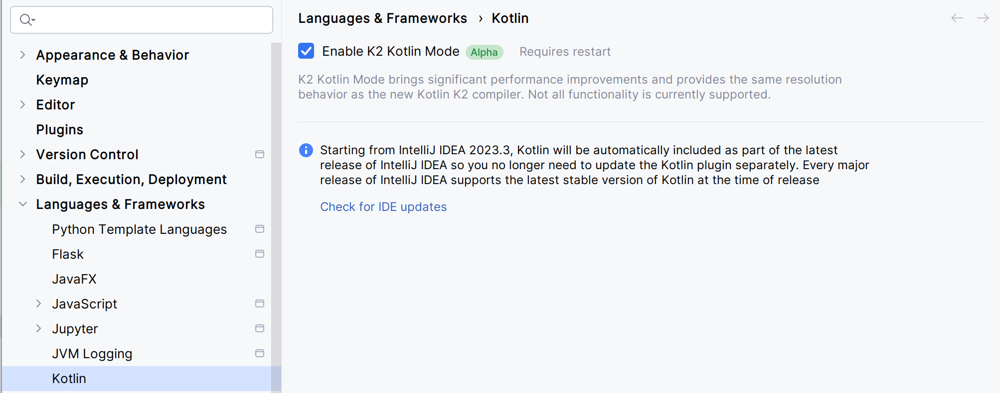
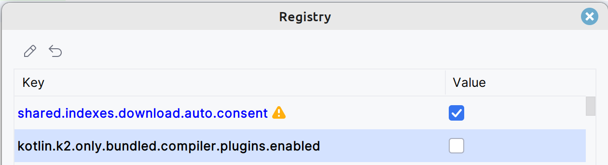
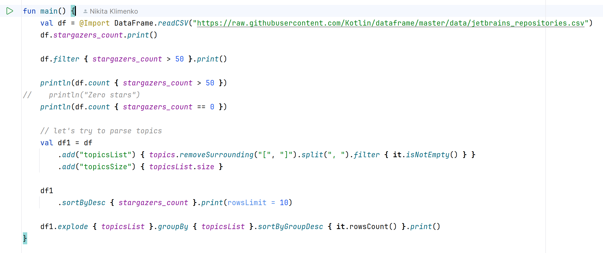

### Overview
This project is a demonstration of Kotlin DataFrame compiler plugin.

### Setup

1. Install `IntelliJ IDEA 2024.2`
2. Enable K2 mode in the Settings

3. Restart the IDE
4. Press Double Shift and search for `Registry`
5. Un-check `kotlin.k2.only.bundled.compiler.plugins.enabled`
   
6. Sync the project

At this point, properties provided by the compiler plugin should appear. If they're red, don't hesitate to reach out for help in the [issue tracker](https://github.com/Kotlin/dataframe/issues).

### Content

Multiple examples are provided: 

1. [WowAH.kt](src%2Fmain%2Fkotlin%2FWowAH.kt) starts with defined DataSchema 
2. [JetBrainsRepositories.kt](src%2Fmain%2Fkotlin%2FJetBrainsRepositories.kt) infers DataSchema from the data
3. [SupportedAPI.kt](src%2Fmain%2Fkotlin%2FSupportedAPI.kt) provides an overview for things that plugin can do.
4. [DataClasses.kt](src%2Fmain%2Fkotlin%2FDataClasses.kt) is an entry point if the data you want to play with can be conveniently created as a list of object instances. Then it can be converted to DataFrame
5. [GenerateSchema.kt](src%2Fmain%2Fkotlin%2FGenerateSchema.kt) and [UseSchema.kt](src%2Fmain%2Fkotlin%2FUseSchema.kt) is an entry point if you have a file or API with data
6. [JetBrainsRepositoriesAdvanced.kt](src/main/kotlin/JetBrainsRepositoriesAdvanced.kt) shows how to create functions 

Have a look at first and second to get an idea why and how the plugin is useful.

If you want to try in with your data,
check out examples 4 and 5. [SupportedAPI.kt](src%2Fmain%2Fkotlin%2FSupportedAPI.kt) will help
to understand where to expect generated properties.
