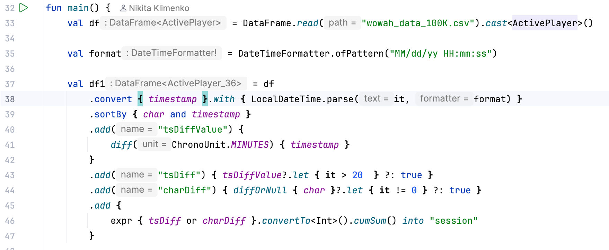

### Overview
This project is a demonstration of Kotlin DataFrame compiler plugin.

### Setup

Install `IntelliJ IDEA 2025.3` or newer

Properties provided by the compiler plugin should appear. If they're red, don't hesitate to reach out for help in the [issue tracker](https://github.com/Kotlin/dataframe/issues).

### Content

Multiple examples are provided: 

1. [WowAH.kt](src%2Fmain%2Fkotlin%2FWowAH.kt) starts with defined DataSchema 
2. [SupportedAPI.kt](src%2Fmain%2Fkotlin%2FSupportedAPI.kt) provides an overview for things that plugin can do.
3. [DataClasses.kt](src%2Fmain%2Fkotlin%2FDataClasses.kt) is an entry point if the data you want to play with can be conveniently created as a list of object instances. Then it can be converted to DataFrame
4. [GenerateSchema.kt](src%2Fmain%2Fkotlin%2FGenerateSchema.kt) and [UseSchema.kt](src%2Fmain%2Fkotlin%2FUseSchema.kt) is an entry point if you have a file or API with data
5. [Kandy.kt](src/main/kotlin/Kandy.kt) shows how properties provided by the plugin can be used to build plots with Kandy